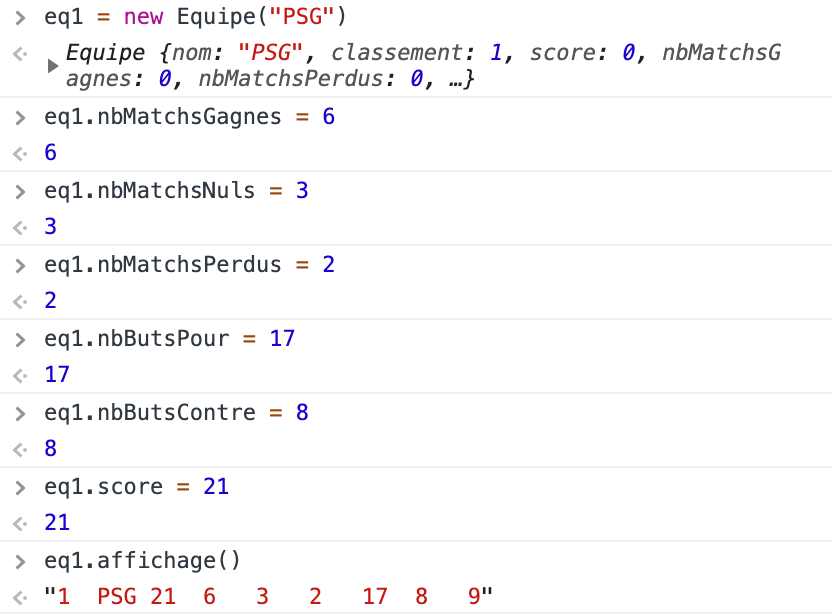
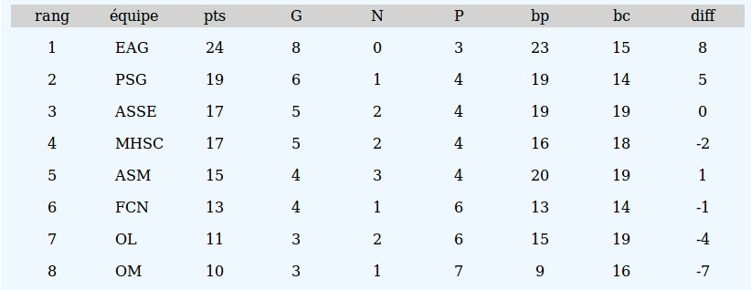
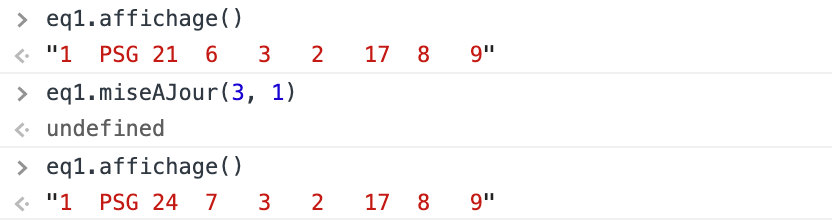
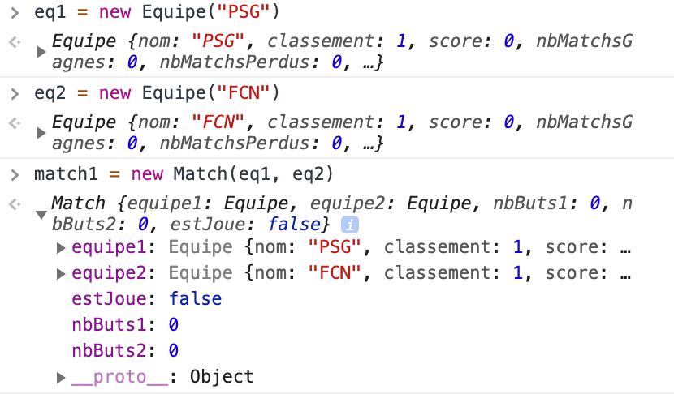
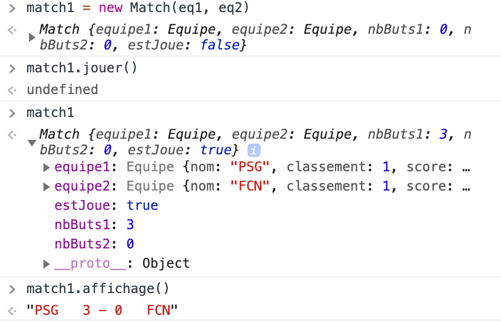

#  Prog web client riche - JavaScript

### IUT Montpellier-Sète – Département Informatique

## TD2
#### _Thème : objets, classes_

Cliquez sur le lien ci-dessous pour faire, dans un dossier public_html/JS/TD2, votre fork privé du TD2 (**attention, pas de fork à la main !**):

https://classroom.github.com/a/bGqJVgX1

<!-- la version [pdf](ressources/td2.pdf) -->

## INTRODUCTION

Pour ce TD2, vous disposez d’une architecture web comprenant un fichier html, un fichier css et quelques autres fichiers. Clonez cette architecture dans un dossier JS/TD2 de votre public_html.

Dans le TD1 nous avons eu une approche fonctionnelle de JavaScript : tout notre code a été construit autour de quelques fonctions, et c’était suffisant.

Dans ce TD2, vous allez devoir construire des objets JavaScript, sans effet immédiat sur le navigateur. La console du navigateur sera par contre d’une grande utilité. La touche F12 sera votre amie …

Quelques éléments de compréhension extra-JavaScript sont utiles  pour réaliser ce TD :
Dans un championnat de foot à 8 équipes, chaque équipe rencontre chacune des sept autres équipes deux fois (match aller et match retour) : une fois sur son terrain (à domicile) et une fois sur le terrain de l’autre équipe (à l’extérieur).

Un championnat à 8 équipes comporte donc 14 journées, chaque journée étant composée de 4 matchs. Le planning de ces 14 journées est donné dans le tableau suivant :

<div align="center">
    <table>
     <thead>
        <tr><th>Journée</th><th>Match n°1</th><th>Match n°2</th><th>Match n°3</th><th>Match n°4</th></tr>
     </thead>
     <tbody>
        <tr><td>Journée n°01</td><td>E1 – E2</td><td>E3 – E4</td><td>E5 – E6</td><td>E7 – E8</td></tr>
        <tr><td>Journée n°02</td><td>E1 – E3</td><td>E2 – E4</td><td>E5 – E7</td><td>E6 – E8</td></tr>
        <tr><td>Journée n°03</td><td>E4 – E1</td><td>E3 – E2</td><td>E8 – E5</td><td>E7 – E6</td></tr>
        <tr><td>Journée n°04</td><td>E1 – E5</td><td>E2 – E6</td><td>E3 – E7</td><td>E4 – E8</td></tr>
        <tr><td>Journée n°05</td><td>E8 – E1</td><td>E2 – E7</td><td>E6 – E3</td><td>E4 – E5</td></tr>
        <tr><td>Journée n°06</td><td>E6 – E1</td><td>E5 – E2</td><td>E8 – E3</td><td>E7 – E4</td></tr>
        <tr><td>Journée n°07</td><td>E1 – E7</td><td>E2 – E8</td><td>E3 – E5</td><td>E4 – E6</td></tr>
        <tr><td>Journée n°08</td><td>E3 – E1</td><td>E4 – E2</td><td>E7 – E5</td><td>E8 – E6</td></tr>
        <tr><td>Journée n°09</td><td>E1 – E4</td><td>E2 – E3</td><td>E5 – E8</td><td>E6 – E7</td></tr>
        <tr><td>Journée n°10</td><td>E5 – E1</td><td>E6 – E2</td><td>E7 – E3</td><td>E8 – E4</td></tr>
        <tr><td>Journée n°11</td><td>E2 – E1</td><td>E4 – E3</td><td>E6 – E5</td><td>E8 – E7</td></tr>
        <tr><td>Journée n°12</td><td>E1 – E8</td><td>E7 – E2</td><td>E3 – E6</td><td>E5 – E4</td></tr>
        <tr><td>Journée n°13</td><td>E1 – E6</td><td>E2 – E5</td><td>E3 – E8</td><td>E4 – E7</td></tr>
        <tr><td>Journée n°14</td><td>E7 – E1</td><td>E8 – E2</td><td>E5 – E3</td><td>E6 – E4</td></tr>
     </tbody>
    </table>
</div>

Ce planning est arrangé pour qu’une équipe ne joue pas plus de 2 matchs consécutifs à domicile (idem à l’extérieur).

Chaque match verra son issue déterminée par un tirage au sort :
- l’équipe jouant à domicile marque un certain nombre de buts ;
- idem pour l’équipe jouant à l’extérieur ;
- en cas de victoire d’une équipe, celle-ci marque 3 points, et l’autre 0 point ; en cas de match nul, chaque équipe marque 1 point ;

On comptabilise en permanence le nombre total de buts marqués par une équipe, ainsi que le nombre total de buts encaissés. Cela peut servir, au niveau du classement, à départager les équipes ayant le même nombre de points.

Les critères pour le classement sont, dans l’ordre :
- le nombre total de points ;
- la différence entre buts marqués et buts encaissés ;
- la meilleure attaque (nombre de buts marqués) ;
- un nombre aléatoire entre 0 et 1 qui départage les ex-aequo éventuels.


## EXERCICE 1 - l'objet Equipe

Une Equipe aura comme attributs :

- son nom ;
- son classement ;
- son nombre de points ;
- son nombre de matchs gagnés (pour enrichir l’affichage) ;
- son nombre de matchs nuls (idem) ;
- son nombre de matchs perdus (idem) ;
- son nombre de buts pour (les buts marqués) ;
- son nombre de buts contre (les buts encaissés) ;
- un nombre aléatoire entre 0 et 1 qui permettra de départager les ex-aequo.


1. Complétez le constructeur donné dans le fichier `equipe.js` (vous pouvez utiliser la fonction `Math.random()` pour générer un nombre aléatoire entre 0 et 1).

2. Ajoutez le script `equipe.js` au fichier `championnat.html` en ajoutant la ligne suivante dans la balise `<head>` :

        <script defer type="text/javascript" src="js/equipe.js"></script>

3. actualisez la page `championnat.html` et testez le constructeur dans la console, par exemple en créant une nouvelle équipe par une instruction comme

        eq1 = new Equipe("PSG");

   puis affichez `eq1` dans la console (`eq1` et `Entrée`). Vous pouvez « déplier » l’objet créé et examiner ce qui s’affiche.

4. Codez la fonction `static compare(eq1, eq2)` qui compare deux équipes selon les critères du classement. La fonction doit renvoyer un nombre strictement positif si l'équipe `eq2` est devant l'équipe `eq1`, un nombre strictement négatif si `eq1` est devant `eq2` et 0 si `eq1 === eq2`.

   Cette fonction doit commencer par essayer de comparer les équipes selon leur nombre de points au classement, puis en cas d'égalité selon leur différence de buts, puis selon le nombre de buts marqués en cas d'égalité sur la différence de buts puis finalement selon leur valeur aléatoire en cas d'égalité de tous les autres critères.

   Testez cette fonction en créant plusieurs équipes et en modifiant « à la main » les valeurs de leurs attributs (dans la console).

   **Dépannage :** Si vous bloquez sur la fonction `compare`, vous pouvez tricher en définissant un score pour chaque équipe `score = points * 10000 + differenceButs * 100 + nbButsPour + nbAlea`, et en comparant le score des 2 équipes.

5. Codez la fonction `affichage()`, équivalent d’un `toString()` et qui donnera le résumé de l’état actuel de l’équipe. Ci-dessous une succession de commandes lancées dans la console, dont l’affichage final :

   <p align="center">
       
   </p>

   Le numéro 1 devant le nom de l’équipe est son classement.

   Pour le moment, ce n'est pas important, mais vous pourrez, **plus tard**, styliser un peu mieux cet affichage pour que les affichages des huit équipes donnent un rendu de tableau, comme ci-dessous :

   <p align="center">
       
   </p>

6. Codez enfin la fonction `miseAJour(nbButsMarques, nbButsEncaisses)` qui met à jour le nombre de points, le nombre de buts pour et contre et le nombre de victoires, nuls et défaites en fonction du résultat d'un match joué par l'équipe.

7. Testez cette nouvelle fonction à partir de `eq1` qui a certaines valeurs d’attributs suite à vos différentes manœuvres. Par exemple, pour continuer le précédent écran :

   <p align="center">
       
   </p>

   Remarque : il peut être utile, puisque nous rafraîchissons régulièrement la page, de sauvegarder les commandes à insérer dans la console dans un script, inséré après `equipe.js`, en bas de `championnat.html` et dont le code pourrait être :

   ```js
    eq1 = new Equipe("PSG");
    eq1.nbMatchsGagnes = 6;
    eq1.nbMatchsNuls = 3;
    eq1.nbMatchsPerdus = 2;
    ...
    ```

8. (Bonus) Comme le nombre de points se déduit des autres attributs, il est plus sage qu'il ne soit pas stocké comme attribut. En effet, on veut éviter qu'un bout de code de `equipe.js` calcule mal ce nombre de points, ce qui affecterait le reste de la classe. **Changez** donc votre code pour remplacer cet attribut par une fonction `nbPoints()` et mettez à jour le reste de votre code.

   De même, comme vous avez utilisé plusieurs fois la différence de buts d'une équipe, il serait de bon aloi d'en faire une méthode.

## EXERCICE 2 - l'objet Match

Un Match aura comme attributs :

- son équipe 1 notée `equipe1` ;
- son équipe 2 notée `equipe2` ;
- le nombre de buts marqués par eq1, qui sera noté `nbButs1`;
- le nombre de buts marqués par eq2, qui sera noté `nbButs2`;
- un booléen `estJoue` qui dit si le match a été joué ou non.


1. Complétez le constructeur donné dans le fichier `match.js`. Vous initialiserez l’attribut `estJoue` à `false`, puisque le match créé n’est pas encore joué. Vous initialiserez les autres attributs de manière sensée.

2. Incorporez le fichier `match.js` à la suite de `equipe.js`.

3. Testez votre constructeur en créant deux équipes, puis un match entre ces deux équipes. Exemple de test :

   <p align="center">
       
   </p>

4. Codez la fonction `jouer()` qui :
   * met à jour `estJoue` ;
   * donne des valeurs aléatoirement à `this.nbButs1` et à `this.nbButs2` : En général, même s’il y a bien des exceptions,
     une équipe qui joue à domicile est légèrement favorisée. À vous de le mettre en œuvre.

     Remarques :

     + `Math.floor(…)` renvoie la partie entière
     + `Math.floor(Math.random()*5)` donne un entier entre 0 et 4.

   * met à jour les attributs des deux équipes du match, à partir des valeurs de `this.nbButs1` et de `this.nbButs2`.

     Conseil : réutilisez la méthode `miseAJour` de `Equipe`.


6. Codez enfin la fonction `affichage()` qui sera le `toString()` du match et qui produira quelque chose comme ça :

   <p align="center">
       
   </p>

## EXERCICE 3 - l'objet Journee

Une Journee aura comme attributs :

- un tableau de 4 matchs ;
- un booléen `estJouee` qui dit si la journée a été jouée ou non.

1. Complétez le constructeur donné dans le fichier `journee.js`. Vous initialiserez l’attribut `estJouee` à `false`.

2. Incorporez le fichier `journee.js` à la suite de `match.js`.

3. Testez votre constructeur comme précédemment, en créant dans la console 8 équipes, puis 4 matchs, puis 1 journée.

4. Codez la fonction `afficher()`. Elle est un peu différente des précédents affichages. En effet, l’idée est ici de remplir le `innerHTML` des 4 `<div>` du document html qui correspondent aux 4 matchs (repérez-les par leurs identifiants). Chacun de ces `<div>` devra refléter l’affichage du match qui lui correspond.

5. Testez votre fonction `afficher()` dans la console. Elle doit produire un affichage visible (enfin !) dans le navigateur. Vous améliorerez l’esthétique de votre affichage plus tard (avec des balises `<table>`). L’essentiel n’est pas là.

6. Codez la fonction `jouer()` qui, si la journée n’est pas encore jouée :
   - joue les 4 matchs de la journée ;
   - passe le booléen played à `true` ;

7. Testez cette fonction en la lançant dans la console après avoir testé votre question 5. Vous devez constater l’affichage des nouveaux scores.


## EXERCICE 4 - l’objet Championnat

1. Le constructeur de Championnat vous est fourni. Un objet Championnat a trois attributs :
   - un tableau d’équipes nommé  `tabEquipes` ;
   - un entier `numJournee` qui dit quelle est la journée active ;
   - un tableau `journees` contenant les 14 journées du planning.

   Analysez ce code et comprenez ce qui est fait. Vous remarquerez en particulier les méthodes sur les tableaux. N’oubliez pas d’insérer le fichier `championnat.js`.

2. Codez la fonction `jouerJournee()` qui doit faire jouer la journée courante `numJournee` du planning : attention, la journée n°1 du planning correspond à l’élément d’indice 0 du tableau `journees` de `this`.

3. Codez la fonction `afficherJournee()` qui doit afficher la journée courante `numJournee` du planning. Même remarque que pour la question précédente.

4. Codez la fonction `afficherClassement()` qui remplira  les huit `<tr>` du `<tbody>` dans `<fieldset id="bloc-classement">`. La n-ième ligne `<tr>` recevra l’affichage de l’équipe qui est classée n-ième.

   Remarque :

   * Servez-vous de la méthode `querySelectorAll` (ou `querySelector` et `children`) vue dans le Cours 2 pour naviguer dans les balises du document HTML.
   * Pour avoir une disposition de tableau propre, il faut mettre à jour `affichage` de `Equipe` pour qu'il remplisse les cases `<td>...<\td>` de chaque ligne `<tr>`.

5. Codez la fonction `classerEquipes()`. Sa mission est de mettre à jour l’attribut classement des 8 équipes après avoir calculé leur évaluation.

   **Aide** :

   1. Il est possible de trier des tableaux en *Javascript* à l'aide de la méthode `Array.sort(compareFunction)`. Cette fonction prend en argument une *fonction de comparaison* qui prend deux arguments. Elle doit renvoyer un nombre strictement positif si le premier argument doit être trié après le second, un nombre strictement négatif si le premier argument doit être trié avant le second et 0 si l'ordre sur les deux arguments n'a pas d'importance (ou si les deux arguments sont identiques). ([Documentation sur MDN](https://developer.mozilla.org/fr/docs/Web/JavaScript/Reference/Objets_globaux/Array/sort))

      Par exemple, si l'on a un tableau `t` d'objets ayant un attribut `age` et qu'on veut les trier par ordre croissant d'âge, on peut utiliser l'instruction

      ```js
      t.sort(function (a, b) {return (a.age - b.age);});
      // Ou de manière équivalente
      // t.sort((a, b) => a.age - b.age);
      ```

      Cette instruction modifie le tableau `t` *en place*, c'est-à-dire que cela modifie directement le tableau `t`.

   2. Comme la fonction `compare` de `Equipe` est statique, on l'appelle avec `Equipe.compare(eq1,eq2)`.

   3. (Facultatif) `t.indexOf(val)` retourne l’indice de `val` dans le tableau `t`.

6. Il serait bon, de nouveau, de tester tout ça dans la console. Voici un exemple de code à insérer dans la console :

   ```js
      let tabEquipes = [new Equipe("PSG"), new Equipe("FCN"), new Equipe("ASM"), new Equipe("RCS"),
                        new Equipe("HAC"), new Equipe("RCL"), new Equipe("TFC"), new Equipe("EAG")];
      // Ou de maniere equivalente
      // let tabNomEquipes = ["PSG", "FCN", "ASM", "RCS", "HAC", "RCL", "TFC", "EAG"];
      // let tabEquipes = tabNomEquipes.map(nomEq => new Equipe(nomEq));
      // (cf documentation de Array.prototype.map sur MDN
      //  https://developer.mozilla.org/fr/docs/Web/JavaScript/Reference/Objets_globaux/Array/map)
      let chp = new Championnat(tabEquipes);
   ```

    Entrez ensuite dans la console les instructions suivantes :

    ```js
    // Journee 1 non jouée
    chp.classerEquipes();
    chp.afficherClassement();
    chp.afficherJournee();
    // Journee 1 jouée
    chp.jouerJournee();
    chp.afficherJournee();
    chp.classerEquipes();
    chp.afficherClassement();
    // Journee 2 non jouée
    chp.numJournee += 1;
    chp.afficherJournee();
    // Journee 2 jouée
    chp.jouerJournee();
    chp.afficherJournee();
    chp.classerEquipes();
    chp.afficherClassement();
    ```

## EXERCICE 5 - le scénario

Et maintenant, le scénario du déroulement du jeu. Vous pouvez supprimer les instructions tests utilisées précédemment. Incluez le fichier `scenario.js` à la suite des 4 autres fichiers. Ce fichier sera une suite d’instructions. Pour le moment, il contient des déclarations de variables :

- des variables qui font le lien avec l’interface html ;
- d’autres variables comme `tabNomEquipes` et `chp`;
    - `tabNomEquipes` sert à remplir les input et la liste des équipes engagées avec des valeurs par défaut,
    - `chp` prendra comme valeur un Championnat (plus tard).

1. Nous allons devoir fréquement afficher ou cacher des éléments en fonction des actions de l'utilisateur. Un élément (*i.e.* une balise HTML) sera caché si il a la classe CSS `cache`, ou affiché sinon. *Complétez* les fonctions `afficher()` et `cacher()`.

   Rappel: Utilisez les méthodes `add/remove` de l'attribut `classList` pour ajouter/supprimer des classes.

### État initial

2. Programmez l’état d’affichage initial suivant :

   + Cacher `bloc-journee` et `bloc-classement`.
   + Afficher `bloc-equipes`.
   + Parmi les enfants du `bloc-equipes` :
      - afficher `<div id="equipes-engagees">`.
      - cacher `<div id="liste-equipes">`.
   + Dans la balise `legend` du `bloc-equipes`, seule l’image « **plus** » est affichée, l’autre est cachée.
   + Quand on lancera le championnat, le `bloc-classement` deviendra visible. Il faut donc faire en sorte que dès à présent, le bouton `journee-suivante` soit caché, contrairement au bouton `jouer-journee`.

2. Il faut aussi préremplir les input des noms d’équipes en cohérence avec la liste des équipes engagées par défaut. Autrement dit, il faut remplir ces `input` avec les valeurs du tableau `tabNomEquipes`. Programmez ceci.

3. Enfin, pour compléter votre état initial, affectez au `innerHTML` de `equipesEngagees` la valeur texte suivante :

        "Équipes engagées : PSG - ASM - OL - OM - FCN - ASSE - MHSC - EAG"

   Programmez tout ceci et testez en rafraîchissant la page.

   **Astuce :** Plutôt que d'écrire la chaîne de caractère "en dur", vous pouvez l'obtenir facilement à partir de `tabNomEquipes`à l'aide de [la méthode `join()` de la classe `Array`](https://developer.mozilla.org/fr/docs/Web/JavaScript/Reference/Objets_globaux/Array/join).


### Gestion des événements click

4. On peut programmer la gestion d’un événement `click` de plusieurs façons (voir TD1). Dans notre cas, nous allons utiliser des « fonctions anonymes » :

   ```js
   boutonPlus.addEventListener("click",function () {
      cacher(boutonPlus);
      afficher(boutonMoins);
      afficher(listeEquipes);
      cacher(equipesEngagees);
   });
   ```

   Dans le code précédent, on affecte à l’attribut `onclick` de `boutonPlus` une valeur de type fonction, qui ne porte pas de nom particulier, et dont le contenu permet d’afficher certains éléments. Un code équivalent aurait été :

   ```js
   function reactionAuClicPlus() {
      cacher(boutonPlus);
      afficher(boutonMoins);
      afficher(listeEquipes);
      cacher(equipesEngagees);
   }

   boutonPlus.addEventListener("click", reactionAuClicPlus);
   ```

   Mais comme cette fonction ne sert que là, on peut la passer en fonction anonyme sans problème.

   Recopiez ce code, anticipez ce qui se passera quand on cliquera sur l’image `plus`. Actualisez la page et vérifiez que le comportement attendu se produit bien.

5. On va maintenant gérer le clic sur l’image `moins`. Adaptez le code précédent pour programmer le comportement suivant, quand on clique sur le moins :

   + l’image `plus` doit réapparaître;
   + l’image `moins` doit disparaître;
   + la `<div id="liste-equipes">` doit disparaître ;
   + le `innerHTML` de la `<div id="equipes-engagees">` doit être recalculé pour afficher le même type de phrase que celle par défaut, mais cette fois ce sont les valeurs des `input` qui serviront ;
   + cette `<div id="equipes-engagees">` doit apparaître ;

   Programmez tout ceci, actualisez la page et vérifiez que les comportements attendus sont opérationnels.

6. Programmons l’action du bouton `lancer-championnat`.

   Celui-ci doit :

   + appeler le constructeur de `Championnat` qui prend en paramètre un tableau de huit `Equipe` construites à partir des 8 champs texte du `bloc-equipes`. Vous utiliserez la variable globale `chp` déclarée au début :
     ```js
     chp = new Championnat(…);
     ```
   + classer ces équipes ;
   + afficher le classement ;
   + actualiser la balise `<legend id="num-journee">` pour que son contenu soit de la forme « journée n°… » (utiliser l’attribut `numJournee`) ;
   + afficher la journée correspondant à `numJournee` (c’est-à-dire afficher les 4 matchs) ;
   + afficher `boutonJouerJournee` et cacher `boutonJourneeSuivante` ;
   + afficher `blocJournee` et `blocClassement`, cacher `bloc-Equipes`;
   + cacher `boutonLancer` (pour éviter les relances maladroites du championnat)

   Essayez de faire tout ça dans une fonction anonyme !

7. Passons à l’action du bouton `jouer-journee`. Celui-ci doit :

    + faire jouer la journée d’indice `numJournee` ;
    + cacher `boutonJouerJournee` ;
    + si `numJournee` est inférieur à 14, afficher `boutonJourneeSuivante` (sinon, le championnat est terminé!) ;
    + classer les équipes ;
    + afficher le classement.

   Pareil, fonction anonyme.


8. Et pour finir, l’action du bouton `journee-suivante`. Celui-ci doit :

    + augmenter `numJournee` d’une unité ;
    + afficher la journée correspondant à cette nouvelle valeur de `numJournee` ;
    + mettre à jour le contenu de la balise `num-journee` ;
    + afficher `boutonJouerJournee` et cacher `boutonJourneeSuivante`.

   Pareil, fonction anonyme.

   Actualisez tout ça, et jouez !
