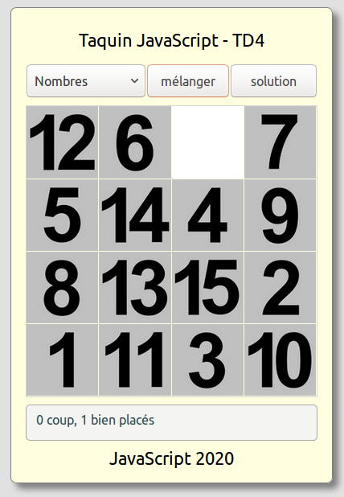
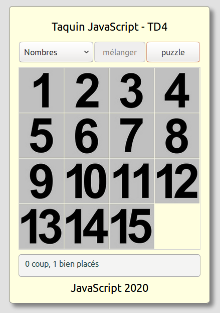
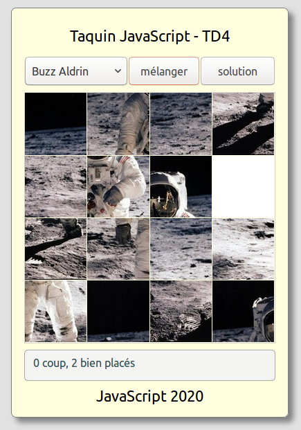
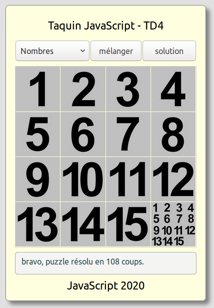

#  Prog web client riche - JavaScript

### IUT Montpellier-Sète – Département Informatique

## TD4
#### _Thème : objets, classes, événements, jeu du taquin_

Cliquez sur le lien ci-dessous pour faire, dans un dossier public_html/JS/TD4, votre fork privé du TD4 (**attention, pas de fork à la main !**):

* Groupe G1 : https://classroom.github.com/a/uDkJgefA - À rendre pour le dimanche 07/03 23h00.
* Groupe G2 : https://classroom.github.com/a/Ao8PRtYj - À rendre pour le vendredi **12/03** 23h00.
* Groupe G3 : https://classroom.github.com/a/ElbVQW7l - À rendre pour le dimanche 07/03 23h00.
* Groupe G4 : https://classroom.github.com/a/kvp7TVgO - À rendre pour le dimanche **14/03** 23h00.

## INTRODUCTION

Dans ce TD, nous allons réinvestir le travail des trois premiers TD pour créer une version web du jeu du taquin. 

Notre taquin est un puzzle de dimensions 4 lignes et 4 colonnes, soit 16 emplacements. Sur ces 16 emplacements se déplacent 15 carrés portant chacun une partie de l'image complète. L'emplacement sans carré permet aux carrés placés sur les emplacements voisins d'être déplacés sur cet emplacement vide.

L'environnement html-css est déjà opérationnel, mais vous pouvez adapter le css si besoin. Le fichier `taquin.html` contient en particulier toute la structure html qui permettra de manipuler les images par l'intermédiaire de l'interface Document Object Model (DOM). 

Vous avez dans le dossier img plusieurs sous-dossiers contenant toutes les images nécessaires pour le jeu. Le nommage des fichiers images est standardisé pour que les actions sur les src des balises images soient simples à écrire. Ainsi, les fichiers :

+ nombres_0.jpg, ..., nombres_14.jpg sont les fragments de l'image solution,

+ nombres_15.jpg est l'image correspondant à la case libre,

+ nombres_16.jpg est l'image grand format de la solution,

+ nombres_.jpg est l'image petit format de la solution.

Le rôle des images nombres_16.jpg et nombres_.jpg est précisé par la suite.

Le css proposé permet une lecture confortable sur quelques smartphones. Il peut être complété à votre guise mais ce n'est pas essentiel (pas un objectif pédagogique à ce stade).

## CONSIGNES

Le travail à accomplir : créer les fichiers JavaScript qui permettent de jouer. 

On pourrait donner une version strictement fonctionnelle du jeu. Mais vous devrez présenter un code obligatoirement organisé en classes.

Prenez le temps qu'il faut pour bien concevoir votre solution. Plus votre point de vue sera précis au départ, plus les méthodes à coder vous apparaîtront clairement. 

Si vous ne prenez pas le temps pour cette phase de conception, vous risquez de coder avec un schéma fluctuant, et donc de produire un code maladroit ou bancal.

## QUELQUES CAPTURES D'ECRAN

**Pour cette partie, le chargé de TD commentera les différentes captures d'écran, au besoin par une démonstration en direct des différentes fonctionnalités.**

### Configuration "puzzle"

Voici le jeu en configuration "puzzle"

   

Au survol, une image "déplaçable" a un curseur souris de type "pointer". Si l'image n'est pas déplaçable, le curseur souris est de type "not-allowed".

Le bouton mélanger, comme son nom l'indique, mélange le puzzle. Il est actif dans la configuration puzzle.

Dans cette configuration, le `
` (qui présente les images partielles nombres_0.jpg, ..., nombres_15.jpg) est en display flex, et le `
` (qui affiche la grande image nombres_16.jpg) en display none.

### Configuration "solution"

Le bouton solution, dans la configuration puzzle, permet de basculer sur l'affichage du puzzle résolu. En configuration puzzle, ce bouton affiche le texte solution, et si on passe en configuration solution, alors le texte du bouton se change en "puzzle", et le bouton mélanger est provisoirement désactivé.

Dans cette configuration, le `
` est passé en display none, et le `
` est passé en display flex.

Voici le jeu en configuration "solution", une fois pressé le bouton solution (qui devient alors le bouton puzzle)

   

### Changement de thème

Le changement de thème ne fait que modifier l'apparence du puzzle, il ne touche en rien la situation des carrés. Si on change de thème, la vue "solution" est bien entendue actualisée. 

Le sélecteur de thèmes permet de changer le thème du jeu. Le thème par défaut est celui des nombres.

Voici un exemple de thème :

   

### Configuration "puzzle résolu"

Quand le puzzle est résolu, une image réduite vient boucher l'emplacement libre. Plus aucune pièce n'est alors déplaçable, et un message prévient l'utilisateur. 

   

**A VOUS !!!**

